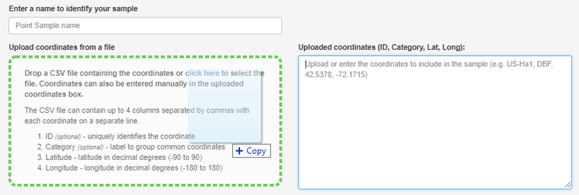
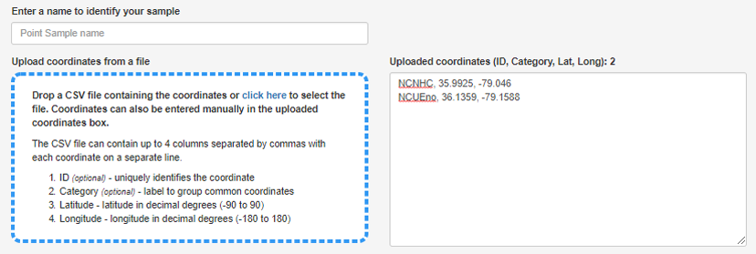
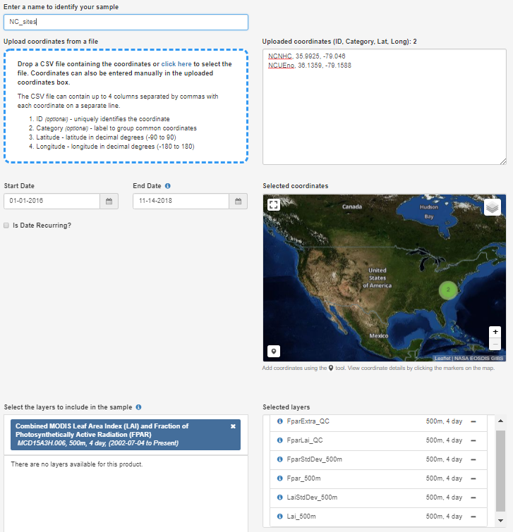
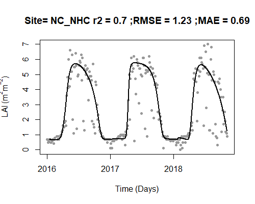
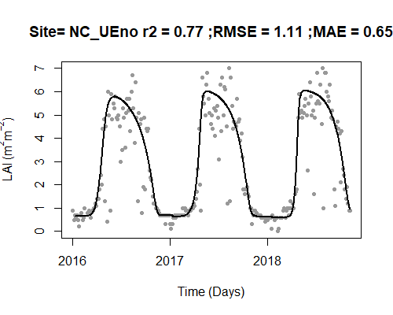
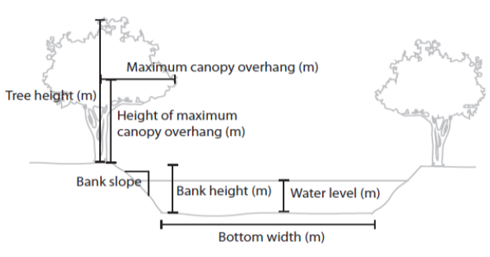
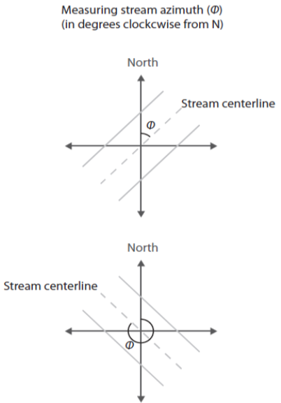

# **1. Overview**

​	Running the **StreamLight** model requires a parameter file that describes various site characteristics and a driver file that contains inputs into the model. For convenience, a series of functions have been included in the companion package **StreamLightUtils** to derive some of the values required for parameter files and to create standardized driver files for use with **StreamLight**. Remotely sensed data products with good broadscale coverage are used to derive these inputs within **StreamLightUtils**, but there are of course many potential sources for similar data that could be used to create driver files and users are welcome to create their own workflow for creating driver or parameter files. This tutorial uses two sites from North Carolina to work through using **StreamLightUtils** to create standardized model driver files, creating parameter files, and generating estimates using **StreamLight**. An outline of topics covered in this tutorial are presented below:

**<font size="+2">Outline</font>**

1.  **Overview and getting started**

    1.1  Overview of the **<span style="color:DarkOrange">stream_light</span>** function
    
    1.2  Getting started
    
2.  **Preparing a driver file**

    2.1  Downloading and processing total incoming shortwave radiation
    
    2.2  Downloading and processing MODIS LAI data
    
    2.3  Creating a standardized driver file

3.  **Preparing site parameters**

    3.1  Parameter descriptions and values

4.  **Running the StreamLight model**

    4.1 Running the model
    
    4.2  Aggregating hourly estimates to daily

## **1.1 Overview of the <span style="color:DarkOrange">stream_light</span> function**

First, let's take a look at the **<span style="color:DarkOrange">stream_light</span>**  function which has the following structure:

**<span style="color:DarkOrange">stream_light</span>**(*<span style="color:#009faf">driver_file</span>*, *<span style="color:#009faf">Lat</span>*, *<span style="color:#009faf">Lon</span>*, *<span style="color:#009faf">channel_azimuth</span>*, *<span style="color:#009faf">bottom_width</span>*, *<span style="color:#009faf">BH</span>*, *<span style="color:#009faf">BS</span>*, *<span style="color:#009faf">WL</span>*, *<span style="color:#009faf">TH</span>*, *<span style="color:#009faf">overhang_height</span>*, *<span style="color:#009faf">x_LAD</span>*) 

- *<span style="color:#009faf">driver_file</span>* The model driver file
- *<span style="color:#009faf">Lat</span>* The site latitude
- *<span style="color:#009faf">Lon</span>* The site longitude
- *<span style="color:#009faf">channel_azimuth</span>* Channel azimuth
- *<span style="color:#009faf">bottom_width</span>* Bottom width (m)
- *<span style="color:#009faf">BH</span>* Bank height (m)
- *<span style="color:#009faf">BS</span>* Bank slope
- *<span style="color:#009faf">WL</span>* Water level (m)
- *<span style="color:#009faf">TH</span>* Tree height (m)
- *<span style="color:#009faf">overhang</span>* Maximum canopy overhang (m)
- *<span style="color:#009faf">overhang_height</span>* Height of the maximum canopy overhang (m). If overhang_height = NA, then the model defaults to a value of 75% of tree height.
- *<span style="color:#009faf">x_LAD</span>* Leaf angle distribution, default = 1

​	The first argument for the function (*<span style="color:#009faf">driver_file</span>*) is a standardized model driver file that contains total
incoming irradiance (W m^-2^) and leaf area index (LAI) (m^2^ m^-2^) which are used as model inputs. The remaining arguments in the function are parameters that describe site characteristics. On the surface this seems like a large number of parameters;however, section 3 of this tutorial provides more indepth information on each of these parameters and some simplifying assumptions that can be used to reduce the number of necessary parameters.

## **1.2 Getting started**

For first time installation run the following code:

```{r, echo=TRUE, message=FALSE, eval=FALSE}
#Install the devtools package if you do not already have it   
  install.packages("devtools")

#Use the devtools packge to install StreamLightUtils
  devtools::install_github("psavoy/StreamLightUtils")
  devtools::install_github("psavoy/StreamLight")
```

Before beginning, Load the **StreamLightUtils** and **StreamLight** libraries.
```{r, echo=TRUE, message=FALSE, eval=TRUE}
library("StreamLightUtils")
library("StreamLight")
```

# **2. Preparing a driver file**

​	There are two necessary components to drive the **StreamLight** model. First, incoming above canopy total irradiance (W m^-2^) is needed as an input into the radiative transfer model. Second, daily estimates of LAI are needed to determine the attenuation of light by canopies within the radiative transfer model. This section walks through downloading and processing this data into a standardized model driver file. 

## **2.1 Downloading and processing total incoming shortwave radiation (W m^-2^)**

​	Total incoming shortwave radiation (W m^-2^) is provided by the National Land Data Assimilation System (NLDAS) at hourly timesteps at 0.125 degree spatial resolution. There are two potential workflows available: i.) download data for a single site, and ii.) bulk download of data for many sites.

### 2.1.1.  **Downloading and processing NLDAS data for a single site**

​	Incoming shortwave radiation data at a single site can be downloaded using the function **<span style="color:DarkOrange">NLDAS_DL</span>** which has the following structure:

**<span style="color:DarkOrange">NLDAS_DL</span>**(*<span style="color:#009faf">save_dir</span>*, *<span style="color:#009faf">Site_ID</span>*, *<span style="color:#009faf">Lat</span>*, *<span style="color:#009faf">Lon</span>*, *<span style="color:#009faf">startDate</span>*)

- *<span style="color:#009faf">save_dir</span>*  The save directory for the downloaded data to be placed in. For example, "C:/"
- *<span style="color:#009faf">Site_ID</span>*  The site identifier ("Site_ID")
- *<span style="color:#009faf">Lat</span>*  The site latitude
- *<span style="color:#009faf">Lon</span>*  The site longitude
- *<span style="color:#009faf">startDate</span>*  The start date for the downloaded data ("YYYY-MM-DD")

​	Once the data has been downloaded it requires some processing to format date and time information and extract the relevant data. The downloaded NLDAS data can be processed using the function **<span style="color:DarkOrange">NLDAS_proc</span>** which has the following structure:

**<span style="color:DarkOrange">NLDAS_proc</span>**(*<span style="color:#009faf">read_dir</span>*, *<span style="color:#009faf">Site_IDs</span>*)    

- *<span style="color:#009faf">read_dir</span>*  The directory containing the downloaded NLDAS data
- *<span style="color:#009faf">Site_IDs</span>*  The Site ID(s) ("Site_ID")
  *<span style="color:#009faf">write_output</span>*  A logical value indicating whether the output should be written to disk (write_output = TRUE) or returned to the R environment (write_output = FALSE). The default value is FALSE since for most datasets this is a suitable approach; however, for very large datasets (thousands of sites) it may be easier to write files to disk instead of storing them in the workspace.
- *<span style="color:#009faf">save_dir</span>*  An optional parameter to use only when write_output = TRUE that indicates the save directory for files to be placed in. For example, "C:/

```{r echo=TRUE, results='hide', eval = FALSE}
#Set the download location (add your own directory)
  working_dir <- "C:/"
    
#Download NLDAS data at NC_NHC
  NLDAS_DL(
    save_dir = working_dir,
    Site_ID = "NC_NHC",
    Lat = 35.9925, 
    Lon = -79.0460, 
    startDate = "2017-01-01"
  )
  
#Process the downloaded data
  NLDAS_processed <- NLDAS_proc(
    read_dir = working_dir, 
    Site_IDs = "NC_NHC"
  )
```

### 2.1.2 **Downloading and processing NLDAS data for multiple sites**

​	Incoming shortwave radiation data at multiple sites can be downloaded using the function **<span style="color:DarkOrange">NLDAS_DL_bulk</span>** which has the following structure:

 **<span style="color:DarkOrange">NLDAS_DL_bulk</span>**(*<span style="color:#009faf">save_dir</span>*, *<span style="color:#009faf">site_locs</span>*, *<span style="color:#009faf">startDate</span>*)

- *<span style="color:#009faf">save_dir</span>*  The save directory for the downloaded data to be placed in. For example, "C:/"

- *<span style="color:#009faf">site_locs</span>*  A table with Site_ID, Lat, and Lon, and startDate

- *<span style="color:#009faf">startDate</span>*  An optional parameter. By default, if nothing is provided the function assumes that site_locs has a column that contains startDate. Alternatively, a single startDate can be provided as an argument for the download (YYYY-MM-DD)

​	Recall from earlier that our table of site information has a column called "startDate", so here the optional parameter is not used. If data fails to download for a site, the **<span style="color:DarkOrange">NLDAS_DL_bulk</span>** function will automatically check and retry downloading data for all sites with  missing data. However, it is possible that data does not exist for a site. Consequently, it is prudent to confirm the successfully downloaded sites.

```{r echo=TRUE, results='hide', eval = FALSE}
#Read in a table with initial site information
  sites <- data(NC_site_basic)

#Download NLDAS data at NC_NHC
  NLDAS_DL_bulk(
    save_dir = working_dir,
    site_locs = sites
  )

#List of successfully downloaded sites
  NLDAS_list <- stringr::str_sub(list.files(working_dir), 1, -11)
  
#Processing the downloaded NLDAS data
  NLDAS_processed <- StreamLightUtils::NLDAS_proc(read_dir = working_dir, NLDAS_list)
```

## **2.2 Downloading and processing MODIS LAI data**

​	There are a variety of sources for LAI data, but for convenience a function is included to process two MODIS LAI products: 1.) MCD15A3H.006 which has 4 day temporal resolution and a pixel size of 500m, and 2.) MCD15A2H.006 which has 8 day temporal resolution and a pixel size of 500m. This example uses MCD15A3H but once the data has been downloaded the process is the same for either product. These products are downloaded through the [AppEEARS website](https://lpdaacsvc.cr.usgs.gov/appeears/ "LP DAAC AppEEARS").

### **2.2.1 Export a table of site information**

​	A .csv of Site_ID, Lat and Lon can be used to submit a request that extracts point samples from multiple locations.

```{r, echo=TRUE, eval = FALSE}
#Make a table for the MODIS request 
  request_sites <- sites[, c("Site_ID", "Lat", "Lon")] 
          
#Export your sites as a .csv for the AppEEARS request  
  write.table(
    request_sites, 
    paste0(working_dir, "/NC_sites.csv"), 
    sep = ",", 
    row.names = FALSE,
    quote = FALSE, 
    col.names = FALSE
  )
```

### **2.2.2 Submitting a request**

​	The functions in **StreamLightUtils** are based on accessing LAI data through the [AppEEARS website](https://lpdaacsvc.cr.usgs.gov/appeears/ "LP DAAC AppEEARS"). This requires a NASA EARTH**DATA** account to access so if you do not already have an account you may [register here]("https://urs.earthdata.nasa.gov/users/new"). Once registered, you can begin by making a request: 

1. Click on Extract > Point Sample from the top menu bar
2. On the next page select Start a new request
3. The NC_sites.csv that was exported can now simply be drag-and-dropped to populate a list of sites. You may notice that special characters like "_" are removed from the ID field, don't worry this is ok. 





4. Next, begin filling in the remaining information to submit a request including a name, Start Date, End Date, and the Selected layers. 
5. If possible, **it is advisable to select dates with some time on either side of the desired period to estimate light**. This is to help constrain some of the LAI processing steps such as interpolating to daily values. For example, if I wanted to run the model for 2015 I might download LAI data from 2014-2016.
6. Type MCD15A3H into the layers search box and select the product. Add all of the layers to the selected layers.    

      

​	Once everything is filled out submit the request. You will recieve an email notification of the request and then a second notification when the download is ready. Downloads are typically ready the same day or within a day or two depending on the size of the request. For reference, the request in this example only took 15 minutes the complete.

### **2.2.3 Unpacking the downloaded LAI data**

​	Once the download is ready it can be processed using two built-in functions to **StreamLightUtils**. The downloaded .zip file can be unpacked using **<span style="color:DarkOrange">AppEEARS_unpack_QC</span>** which has the following structure:

**<span style="color:DarkOrange">AppEEARS_unpack_QC</span>**(*<span style="color:#009faf">zip_file</span>*, *<span style="color:#009faf">zip_dir</span>*, *<span style="color:#009faf">request_sites</span>*)     

- *<span style="color:#009faf">zip_file</span>*  The name of the zip file. For example, "myzip.zip"

- *<span style="color:#009faf">zip_dir</span>*  The directory the zip file is located in. For example, "C:/"

- *<span style="color:#009faf">request_sites</span>*  A string of site IDs 

  

  This function returns the unpacked data as a list, with each element in the list representing the data for a given site.

```{r, echo=TRUE, eval = FALSE}
MOD_unpack <- AppEEARS_unpack_QC(
  zip_file = "nc-sites.zip", 
  zip_dir = working_dir, 
  request_sites[, "Site_ID"]
)
```

### **2.2.4 Processing the downloaded LAI data**

​	The **StreamLightUtils** package leverages the [**phenofit package**](https://github.com/kongdd/phenofit) to help handling the processing of LAI data. There are a variety of curve fitting methods and this tutorial uses the approach from [Gu et al. (2009)](https://doi.org/10.1007/978-1-4419-0026-5_2)  The unpacked data can then be processed using **<span style="color:DarkOrange">AppEEARS_proc</span>** which has the following structure: 

**<span style="color:DarkOrange">AppEEARS_proc</span>**(*<span style="color:#009faf">Site</span>*, *<span style="color:#009faf">proc_type</span>*)  

- *<span style="color:#009faf">unpacked_LAI</span>*  Output from the AppEEARS_unpack_QC function
- *<span style="color:#009faf">fit_method</span>*  There are several options available from the phenofit package including "AG", "Beck", "Elmore", "Gu", "Klos", "Zhang".
- *<span style="color:#009faf">write_ouput</span>*  Logical indicating whether to write each individual driver file to disk. Default value is FALSE.
- *<span style="color:#009faf">save_dir</span>*  Optional parameter when write_output = TRUE. The save directory for files to be placed in. For example, "C:/
- *<span style="color:#009faf">plot</span>*  Logical, where plot = TRUE generates a plot and plot = FALSE does not

​	Let's process the LAI data and visualize the results. The black line is the new fitted, interpolated, daily LAI.

```{r, out.width=c('50%', '50%'), fig.show='hold',echo=TRUE, eval = FALSE}
MOD_processed <- AppEEARS_proc(
  unpacked_LAI = MOD_unpack,  
  fit_method = "Gu", 
  plot = TRUE
)
```






## **2.3 Creating a standardized driver file**

Finally, a driver file can be made using the **<span style="color:DarkOrange">make_driver</span>**  function which has the following structure:

**<span style="color:DarkOrange">make_driver</span>**(*<span style="color:#009faf">site_locs</span>*, *<span style="color:#009faf">NLDAS_processed</span>*, *<span style="color:#009faf">MOD_processed</span>*, *<span style="color:#009faf">write_output</span>*, *<span style="color:#009faf">save_dir</span>*) 

- *<span style="color:#009faf">site_locs</span>* A table with Site_ID, Lat, and Lon, and the coordinate reference system designated as an EPSG code. 
  For example, the most common geographic system is WGS84 and its EPSG code is 4326
- *<span style="color:#009faf">NLDAS_processed</span>* Output from the **<span style="color:DarkOrange">NLDAS_proc</span>** function
  *<span style="color:#009faf">MOD_processed</span>* Output from the **<span style="color:DarkOrange">AppEEARS_proc</span>** function
- *<span style="color:#009faf">write_output</span>* Logical value to indicate whether to write each individual driver file to disk. Default value is FALSE.
- *<span style="color:#009faf">save_dir</span>* Optional parameter when write_output = TRUE. The save directory for files to be placed in. For example, "C:/

```{r, echo=FALSE, eval=FALSE}
#Make the driver files
make_driver(
  site_locs = sites,
  NLDAS_processed = NLDAS_processed,
  MOD_processed = MOD_processed
)
```

Let's take a moment to examine the final structure of the driver file

```{r, echo=TRUE}
#Read in a driver file
  data(NC_NHC_driver)
  head(NC_NHC_driver)
```

The columns are as follows: 

- "local_time" A POSIXct object in local time
- "offset" The offset of local time from UTC, used in the **<span style="color:DarkOrange">solar_c function</span>**
- "jday" A unique identifier for each day in the format YYYY + day of year
- "DOY" The day of year (1-365 or 366 for leap years)
- "Hour" Hour (0-23)
- "SW_inc" Total incoming shortwave radiation (W m^-2^) from NLDAS 
- "LAI" MODIS leaf area index (m^2^ m^-2^) interpolated to daily values by **<span style="color:DarkOrange">AppEEARS_proc</span>** 

# **3. Preparing a parameter file**

​	There are several site parameters required to run **StreamLight**; however, not all of these parameters have built in functions within **StreamLightUtils**. Similarly, not all parameters are easily obtained nor will they all have equal importance for model performance. Here, we detail the same process used to extract parameter values from Savoy et al. (in review). To begin with, let's revisit the parameters used:
​    

​    

- *<span style="color:#009faf">Lat</span>* The site latitude
- *<span style="color:#009faf">Lon</span>* The site longitude
- *<span style="color:#009faf">channel_azimuth</span>* Channel azimuth
- *<span style="color:#009faf">bottom_width</span>* Bottom width (m) 
- *<span style="color:#009faf">BH</span>* Bank height (m)
- *<span style="color:#009faf">BS</span>* Bank slope
- *<span style="color:#009faf">WL</span>* Water level (m)
- *<span style="color:#009faf">TH</span>* Tree height (m)
- *<span style="color:#009faf">overhang</span>* Maximum canopy overhang (m)
- *<span style="color:#009faf">overhang_height</span>* Height of the maximum canopy overhang (m)
- *<span style="color:#009faf">x_LAD</span>*  Leaf angle distribution

​	To run the model on multiple sites it is easiest to construct a table of parameters for each site such as the following example. 

```{r, echo=FALSE}
#Load the example parameter file
  data(NC_params)
  head(NC_params, n = 2)
```

## **3.1 Parameter descriptions and values**  

### **3.1.1 Channel azimuth (*<span style="color:#009faf">channel_azimuth</span>*)**

​	Currently there is no functionality to derive stream azimuth within **StreamLightUtils**. In the meantime, these can be derived manually using aerial photographs, flowlines, or field derived measurements. Because we have based our model on SHADE2 (Li et al., 2012), we follow their conventions where stream azimuth is measured clockwise from North (see figure below). However, at present both banks are parameterized identically in **StreamLight** (e.g. only a single tree height is put in instead of the heights of trees on either bank) and so in reality a channel azimuth of 45$^\circ$ and 225$^\circ$ will yield the same results. We only mention this point in case future development may allow for parameterizing banks separately, or in case someone wanted to modify the code on their own to add in this functionality.

Example of deriving azimuth, note the first azimuth of the first example is 45$^\circ$ whereas the second example is 315$^\circ$.      

​												  

### **3.1.2 Width (*<span style="color:#009faf">bottom_width</span>*)**

​	The widths used in this tutorial are from field measurements. However, if field measurements are not available or feasible there are various remotely sensed products such as the [NARWidth dataset](http://gaia.geosci.unc.edu/NARWidth/)from [Allen & Pavelsky](https://science.sciencemag.org/content/361/6402/585). There are also empirically-derived estimates, such as those from [McManamay *& DeRolph, 2019](https://www.nature.com/articles/sdata201917).

### **3.1.3 Bank height (*<span style="color:#009faf">BH</span>*)**

Without detailed information of bank heights a default value of 0.1m was used for all sites.

### **3.1.4 Bank slope (*<span style="color:#009faf">BS</span>*)**

Without detailed information of bank slopes a default value of 100 was used for all sites.

### **3.1.5 Water level (*<span style="color:#009faf">WL</span>*)**

Without detailed information of water level a default value of 0.1m was used for all sites.

### **3.1.6 Tree height (*<span style="color:#009faf">TH</span>*)**

​	**StreamLightUtils** has a built in function to derive tree height using the LiDAR derived estimates of Simard et al. (2011). The function **<span style="color:DarkOrange">extract_height</span>** will retrieve an estimate of tree height (m) based on latitude and longitude and has the following structure:

**<span style="color:DarkOrange">extract_height</span>**(*<span style="color:#009faf">Site_ID</span>*, *<span style="color:#009faf">Lat</span>*, *<span style="color:#009faf">Lon</span>*)     

- *<span style="color:#009faf">Site_ID</span>* The site identifier ("Site_ID")
- *<span style="color:#009faf">Lat</span>* The site latitude
- *<span style="color:#009faf">Lon</span>* The site longitude
- *<span style="color:#009faf">site_crs</span>* The coordinate reference system of the points, preferably designated as an EPSG code. For example, the most common geographic system is WGS84 and its EPSG code is 4326.
      

Although this parameter file already contains tree height, the following is an example of how to use this funciton

```{r, echo=TRUE, eval = FALSE}
#Extract tree height
  extract_height(
    Site_ID = NC_params[, "Site_ID"], 
    Lat = NC_params[, "Lat"],
    Lon = NC_params[, "Lon"],
    site_crs = NC_params[, "epsg_crs"]
  )
```

### **3.1.7 Maximum canopy overhang (*<span style="color:#009faf">overhang</span>*)**

Without detailed information on canopy overhang it was assumed that overhang was 10% of tree height at all sites.

### **3.1.8 Height of maximum canopy overhang (*<span style="color:#009faf">overhang_height</span>*)**

​	Without detailed information on the height of maximum canopy overhang a value of NA can be used. When *<span style="color:#009faf">overhang_height</span>* = NA, the model will default to using 75% of tree height.

### **3.1.9 Leaf angle distribution(*<span style="color:#009faf">x_LAD</span>*)**

​	Most canopies can be approximated by a spherical distribution of leaf angles (*x* = 1) (Campbell & Norman, 1998), and so *<span style="color:#009faf">x_LAD</span>* was set to 1 at all sites.

# **4. Running StreamLight**

​	First time installation of the **StreamLight** package from GitHub can be done with the devtools library and once installed, the package can be loaded as normal.

```{r, echo=TRUE}
devtools::install_github("psavoy/StreamLight")
library("StreamLight")
```

Estimates of average light across a transect can be estimated using the **<span style="color:DarkOrange">stream_light</span>**  function which has the following structure:

**<span style="color:DarkOrange">stream_light</span>**(*<span style="color:#009faf">driver_file</span>*, *<span style="color:#009faf">Lat</span>*, *<span style="color:#009faf">Lon</span>*, *<span style="color:#009faf">channel_azimuth</span>*, *<span style="color:#009faf">bottom_width</span>*, *<span style="color:#009faf">BH</span>*, *<span style="color:#009faf">BS</span>*, *<span style="color:#009faf">WL</span>*, *<span style="color:#009faf">TH</span>*, *<span style="color:#009faf">overhang_height</span>*, *<span style="color:#009faf">x_LAD</span>*) 

  * *<span style="color:#009faf">driver_file</span>* The model driver file
  * *<span style="color:#009faf">Lat</span>* The site latitude
  * *<span style="color:#009faf">Lon</span>* The site longitude
  * *<span style="color:#009faf">channel_azimuth</span>* Channel azimuth
  * *<span style="color:#009faf">bottom_width</span>* Bottom width (m)
  * *<span style="color:#009faf">BH</span>* Bank height (m)
  * *<span style="color:#009faf">BS</span>* Bank slope
  * *<span style="color:#009faf">WL</span>* Water level (m)
  * *<span style="color:#009faf">TH</span>* Tree height (m)
  * *<span style="color:#009faf">overhang</span>* Maximum canopy overhang (m)
  * *<span style="color:#009faf">overhang_height</span>* Height of the maximum canopy overhang (m). If overhang_height = NA, then the model defaults to a value of 75% of tree height.
  * *<span style="color:#009faf">x_LAD</span>* Leaf angle distribution, default = 1

​	As outlined in the previous section on preparing parameter files. In Savoy et al. (in review) we made some simplifying assumptions to facilitate applying this model easily to locations that lacked detailed **in situ** measurements.

## **4.1 Running the model**

### **4.1.1 Generate estimates for a single site**

To run the model for a single site simply add the parameters to the function.

```{r, echo = TRUE, eval = FALSE}
#Load the example driver file for NC_NHC
  data(NC_NHC_driver)

#Run the model
  NC_NHC_modeled <- stream_light(
    NC_NHC_driver, 
    Lat = 35.9925, 
    Lon = -79.0460, 
    channel_azimuth = 330, 
    bottom_width = 18.9, 
    BH = 0.1, 
    BS = 100, 
    WL = 0.1, 
    TH = 23, 
    overhang = 2.3, 
    overhang_height = NA, 
    x_LAD = 1
  )
```

### **4.1.2 Generate estimates for multiple sites**

​	It is also possible to then loop over multiple sites by wrapping the model in another function and below is an example of this that could be adapted to your own workflow.

```{r, echo=TRUE, results = 'hide', eval = FALSE}
#Function for batching over multiple sites
  batch_model <- function(Site, read_dir, save_dir){
    #Get the model driver
      driver_file <- readRDS(paste(read_dir, "/", Site, "_driver.rds", sep = ""))

    #Get model parameters for the site
      site_p <- params[params[, "Site_ID"] == Site, ]

    #Run the model
      modeled <- stream_light(
        driver_file, 
        Lat = site_p[, "Lat"], 
        Lon = site_p[, "Lon"],
        channel_azimuth = site_p[, "Azimuth"], 
        bottom_width = site_p[, "Width"], 
        BH = site_p[, "BH"],
        BS = site_p[, "BS"], 
        WL = site_p[, "WL"], 
        TH = site_p[, "TH"], 
        overhang = site_p[, "overhang"],
        overhang_height = site_p[, "overhang_height"], 
        x_LAD = site_p[, "x"]
      )

    #Save the output
      saveRDS(modeled, paste(save_dir, "/", Site, "_predicted.rds", sep = ""))

  } #End batch_model 

#Applying the model to all sites
  model_rd <- working_dir
  model_sd <- working_dir

#Running the model
  lapply(
    params[, "Site_ID"], 
    FUN = batch_model, 
    read_dir = model_rd,
    save_dir = model_sd
  ) 

#Take a look at the output
  data(NC_NHC_predicted)
  NC_NHC_predicted[1:2, ]
```
The columns are as follows: 

- "local_time" A POSIXct object in local time
- "offset" The offset of local time from UTC, used in the solar_c function
- "jday" A unique identifier for each day in the format YYYY + day of year
- "Year" The year 
- "DOY" The day of year (1-365 or 366 for leap years)
- "Hour" Hour (0-23)
- "SW_inc" Total incoming shortwave radiation (W m^-2^) from NLDAS 
- "LAI" MODIS leaf area index (m^2^ m^-2^) interpolated to daily values by **<span style="color:DarkOrange">AppEEARS_proc</span>** 
- "PAR_inc" -- Incoming PAR above the canopy (<font size="+1">$\mu$</font>mol m^-2^ s^-1^) 
- "PAR_bc" -- Estimated PAR (<font size="+1">$\mu$</font>mol m^-2^ s^-1^) directly below the canopy 
- "veg_shade" The proportion of the channel crossection that is shaded by riparian vegetation
- "bank_shade" -- The proportion of the channel crossection that is shaded by stream banks
- "PAR_stream" The estimated PAR for the channel cross section (<font size="+1">$\mu$</font>mol m^-2^ s^-1^)