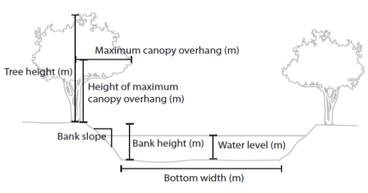

# 3. Using stream_light

## Introduction

This article will demonstrate creating estimates of photosynthetically
active radiation (PAR) using the **stream_light** function. The details
and application of this model are detailed in [Savoy et
al. (2021)](https://www.journals.uchicago.edu/doi/10.1086/714270).

**Outline**

1.  *Overview:* General overview of the function structure.
2.  *Preparing a driver file:* Assembling timeseries of model drivers to
    be fed into the model.
3.  *Preparing a parameter file:* Creating a parameter file that
    describes various site conditions.
4.  *Running **stream_light**:* Example code of how to run the model.

### 1. Introduction to the stream_light function

First, let’s take a look at the **stream_light** function which has the
following structure:

**stream_light**(*driver_file*, *Lat*, *Lon*, *channel_azimuth*,
*bottom_width*, *BH*, *BS*, *WL*, *TH*, *overhang_height*, *x_LAD*)

- *driver_file* The model driver file
- *Lat* The site latitude
- *Lon* The site longitude
- *channel_azimuth* Channel azimuth
- *bottom_width* Bottom width (m)
- *BH* Bank height (m)
- *BS* Bank slope
- *WL* Water level (m)
- *TH* Tree height (m)
- *overhang* Maximum canopy overhang (m)
- *overhang_height* Height of the maximum canopy overhang (m). If
  overhang_height = NA, then the model defaults to a value of 75% of
  tree height.
- *x_LAD* Leaf angle distribution, default = 1

Running **stream_light** model requires a parameter file that describes
various site characteristics and a driver file that contains inputs into
the model. The first argument for the function (*driver_file*) is a
standardized model driver file that contains total incoming irradiance
(W m⁻²) and leaf area index (LAI) (m² m⁻²) which are used as model
inputs. The remaining arguments in the function are parameters that
describe site characteristics. On the surface this seems like a large
number of parameters;however, this tutorial provides more indepth
information on each of these parameters and some simplifying assumptions
that can be used to reduce the number of necessary parameters.

### 2. Preparing a driver file

There are two necessary components to drive **stream_light**. First,
incoming above canopy total irradiance (W m⁻²) is needed as an input
into the radiative transfer model. Second, daily estimates of LAI are
needed to determine the attenuation of light by canopies within the
radiative transfer model. A set of functions is included in the
**StreamLightUtils** package to help create a standardized model driver
file.

The structure of the model driver is as follows:

- **“local_time”**: A POSIXct object in local time
- **“offset”**: The UTC offset for local time (hours), used in the
  **solar_c function**
- **“jday”**: A unique identifier for each day that combines year and
  day of year information in the format YYYYddd
- **“DOY”**: The day of year (1-365 or 366 for leap years)
- **“Hour”**: Hour of the day (0-23)
- **“SW_inc”**: Total incoming downwelling shortwave radiation (W m⁻²).
  **StreamLightUtils** provides tools to get hourly data from NLDAS.
- **“LAI”**: MODIS leaf area index (m² m⁻²). **StreamLightUtils**
  provides tools to generate interpolated to daily values using the
  **AppEEARS_proc** function.

A driver file with the same structure as above can be made using the
**make_driver** function from **StreamLightUtils** which has the
following structure:

**make_driver**(*site_locs*, *NLDAS_processed*, *MOD_processed*,
*write_output*, *save_dir*)

- *site_locs* A table with Site_ID, Lat, and Lon, and the coordinate
  reference system designated as an EPSG code. For example, the most
  common geographic system is WGS84 and its EPSG code is 4326
- *nldas_prepped* Output from the **nldas_prep** function (from
  **StreamLightUtils**)
- *modis_prepped* Output from the **appeears_prep** function (from
  **StreamLightUtils**)
- *write_output* Logical value to indicate whether to write each
  individual driver file to disk. Default value is FALSE.
- *save_dir* Optional parameter when write_output = TRUE. The save
  directory for files to be placed in. For example, “C:/

Let’s take a moment to examine the final structure of the driver file

``` r
#Read in a driver file
  data("NC_NHC_driver", package = "StreamLight")
  head(NC_NHC_driver)
```

### 3. Preparing a parameter file

There are several site parameters required to run **stream_light**;
however, not all of these parameters have built in functions within
**StreamLightUtils**. Similarly, not all parameters are easily obtained
nor will they all have equal importance for model performance. Here, we
detail the same process used to extract parameter values from [Savoy et
al. (2021)](https://www.journals.uchicago.edu/doi/10.1086/714270). To
begin with, let’s revisit the parameters used:



A schematic of various input parameters.

- *Lat* The site latitude
- *Lon* The site longitude
- *channel_azimuth* Channel azimuth
- *bottom_width* Bottom width (m)
- *BH* Bank height (m)
- *BS* Bank slope
- *WL* Water level (m)
- *TH* Tree height (m)
- *overhang* Maximum canopy overhang (m)
- *overhang_height* Height of the maximum canopy overhang (m)
- *x_LAD* Leaf angle distribution

To run the model on multiple sites it is easiest to construct a table of
parameters for each site such as the following example.

#### **Parameter descriptions and values**

##### **Channel azimuth (*channel_azimuth*)**

Currently there is no functionality to derive stream azimuth within
**StreamLightUtils**. In the meantime, these can be derived manually
using aerial photographs, flowlines, or field derived measurements.
Because we have based our model on SHADE2 (Li et al., 2012), we follow
their conventions where stream azimuth is measured clockwise from North
(see figure below). However, at present both banks are parameterized
identically in **StreamLight** (e.g. only a single tree height is put in
instead of the heights of trees on either bank) and so in reality a
channel azimuth of 45\\^\circ\\ and 225\\^\circ\\ will yield the same
results. We only mention this point in case future development may allow
for parameterizing banks separately, or in case someone wanted to modify
the code on their own to add in this functionality.

Example of deriving azimuth, note the first azimuth of the first example
is 45\\^\circ\\ whereas the second example is 315\\^\circ\\.


##### **Width (*bottom_width*)**

The widths used in this tutorial are from field measurements. However,
if field measurements are not available or feasible there are various
remotely sensed products such as the [NARWidth
dataset](http://gaia.geosci.unc.edu/NARWidth/) from [Allen &
Pavelsky](https://science.sciencemag.org/content/361/6402/585). There
are also empirically-derived estimates, such as those from [McManamay &
DeRolph, 2019](https://www.nature.com/articles/sdata201917).

##### **Bank height (*BH*)**

Without detailed information of bank heights a default value of 0.1m was
used for all sites.

##### **Bank slope (*BS*)**

Without detailed information of bank slopes a default value of 100 was
used for all sites.

##### **Water level (*WL*)**

Without detailed information of water level a default value of 0.1m was
used for all sites.

##### **Tree height (*TH*)**

**StreamLightUtils** has a built in function to derive tree height using
the LiDAR derived estimates of Simard et al. (2011). The function
**extract_height** will retrieve an estimate of tree height (m) based on
latitude and longitude and has the following structure:

**extract_height**(*Site_ID*, *Lat*, *Lon*)

- *Site_ID* The site identifier (“Site_ID”)
- *Lat* The site latitude
- *Lon* The site longitude
- *site_crs* The coordinate reference system of the points, preferably
  designated as an EPSG code. For example, the most common geographic
  system is WGS84 and its EPSG code is 4326.

Although this parameter file already contains tree height, the following
is an example of how to use this funciton

``` r
#Extract tree height
  extract_height(
    Site_ID = "NC_NHC", 
    Lat = 35.9925,
    Lon = -79.046,
    site_crs = 4326
  )

#Or iterate over multiple sites
  mapply(
    FUN = extract_height,
    Site_ID = NC_params[, "Site_ID"], 
    Lat = NC_params[, "Lat"],
    Lon = NC_params[, "Lon"],
    site_crs = NC_params[, "epsg_crs"],
    simard2011 = simard2011,
    SIMPLIFY = TRUE
  ) |>
    t() |>
    as.data.frame()
```

##### **Maximum canopy overhang (*overhang*)**

Without detailed information on canopy overhang it was assumed that
overhang was 10% of tree height at all sites.

##### **Height of maximum canopy overhang (*overhang_height*)**

Without detailed information on the height of maximum canopy overhang a
value of NA can be used. When *overhang_height* = NA, the model will
default to using 75% of tree height.

##### **Leaf angle distribution(*x_LAD*)**

Most canopies can be approximated by a spherical distribution of leaf
angles (*x* = 1) (Campbell & Norman, 1998), and so *x_LAD* was set to 1
at all sites.

### 4. Running StreamLight

First time installation of the **StreamLight** package from GitHub can
be done with the devtools library and once installed, the package can be
loaded as normal.

``` r
devtools::install_github("psavoy/StreamLight")
library("StreamLight")
```

Estimates of average light across a transect can be estimated using the
**stream_light** function which has the following structure:

**stream_light**(*driver_file*, *Lat*, *Lon*, *channel_azimuth*,
*bottom_width*, *BH*, *BS*, *WL*, *TH*, *overhang_height*, *x_LAD*)

- *driver_file* The model driver file
- *Lat* The site latitude
- *Lon* The site longitude
- *channel_azimuth* Channel azimuth
- *bottom_width* Bottom width (m)
- *BH* Bank height (m)
- *BS* Bank slope
- *WL* Water level (m)
- *TH* Tree height (m)
- *overhang* Maximum canopy overhang (m)
- *overhang_height* Height of the maximum canopy overhang (m). If
  overhang_height = NA, then the model defaults to a value of 75% of
  tree height.
- *x_LAD* Leaf angle distribution, default = 1

As outlined in the previous section on preparing parameter files. In
[Savoy et
al. (2021)](https://www.journals.uchicago.edu/doi/10.1086/714270) we
made some simplifying assumptions to facilitate applying this model
easily to locations that lacked detailed *in situ* measurements.

#### **Generate estimates for a single site**

To run the model for a single site simply add the parameters to the
function.

``` r
#Load the example driver file for NC_NHC
  data("NC_NHC_driver", package = "StreamLight")

#Run the model
  NC_NHC_modeled <- stream_light(
    NC_NHC_driver, 
    Lat = 35.9925, 
    Lon = -79.0460, 
    channel_azimuth = 330, 
    bottom_width = 18.9, 
    BH = 0.1, 
    BS = 100, 
    WL = 0.1, 
    TH = 23, 
    overhang = 2.3, 
    overhang_height = NA, 
    x_LAD = 1
  )
```

#### **Generate estimates for multiple sites**

It is also possible to then loop over multiple sites by wrapping the
model in another function and below is an example of this that could be
adapted to your own workflow.

``` r
#Function for batching over multiple sites
  batch_model <- function(Site, parameters, read_dir){
    #Get the model driver
      driver_file <- readRDS(here::here(read_dir, paste0(Site, "_driver.rds")))
      
    #Get model parameters for the site
      site_p <- parameters[parameters[, "Site_ID"] == Site, ]

    #Run the model
      modeled <- stream_light(
        driver_file, 
        Lat = site_p[, "Lat"], 
        Lon = site_p[, "Lon"],
        channel_azimuth = site_p[, "Azimuth"], 
        bottom_width = site_p[, "Width"], 
        BH = site_p[, "BH"],
        BS = site_p[, "BS"], 
        WL = site_p[, "WL"], 
        TH = site_p[, "TH"], 
        overhang = site_p[, "overhang"],
        overhang_height = site_p[, "overhang_height"], 
        x_LAD = site_p[, "x"]
      )

    return(modeled)

  } #End batch_model 

#Running the model
  modeled_light <- lapply(
    NC_params[, "Site_ID"], 
    FUN = batch_model, 
    parameters = NC_params,
    read_dir = here::here("output")
  )
  
  names(modeled_light) <- NC_params[, "Site_ID"]

#Take a look at the output
  data("NC_NHC_predicted", package = "StreamLight")
  NC_NHC_predicted[1:2, ]
```

The columns are as follows:

- **“local_time”**: A POSIXct object in local time
- **“offset”**: The UTC offset for local time (hours), used in the
  **solar_c function**
- **“jday”**: A unique identifier for each day that combines year and
  day of year information in the format YYYYddd
- **“DOY”**: The day of year (1-365 or 366 for leap years)
- **“Hour”**: Hour of the day (0-23)
- **“SW_inc”**: Total incoming downwelling shortwave radiation (W m⁻²).
  **StreamLightUtils** provides tools to get hourly data from NLDAS.
- **“LAI”**: MODIS leaf area index (m² m⁻²). **StreamLightUtils**
  provides tools to generate interpolated to daily values using the
  **AppEEARS_proc** function.
- **“PAR_inc”**: Incoming PAR above the canopy (\\\mu\\mol m⁻² s⁻¹)
- **“PAR_bc”**: Estimated PAR (\\\mu\\mol m⁻² s⁻¹) directly below the
  canopy
- **“veg_shade”**: The proportion of the channel crossection that is
  shaded by riparian vegetation
- **“bank_shade”**: The proportion of the channel crossection that is
  shaded by stream banks
- **“PAR_stream”**: The estimated PAR for the channel cross section
  (\\\mu\\mol m⁻² s⁻¹)
