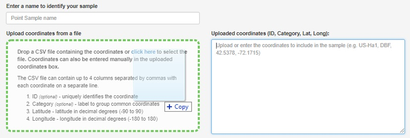
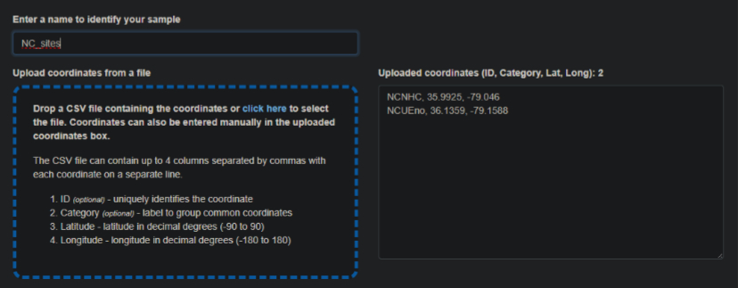
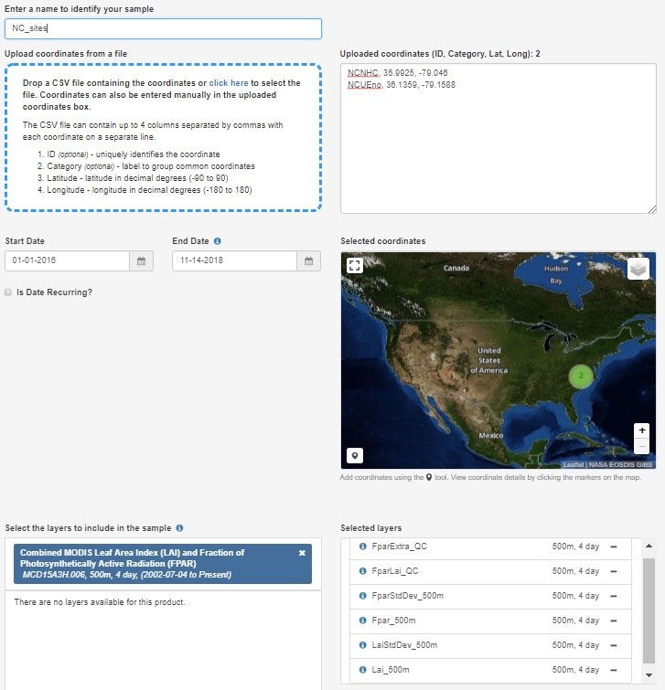
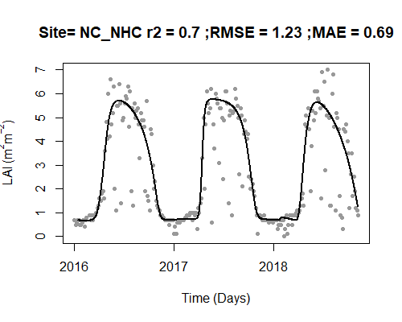
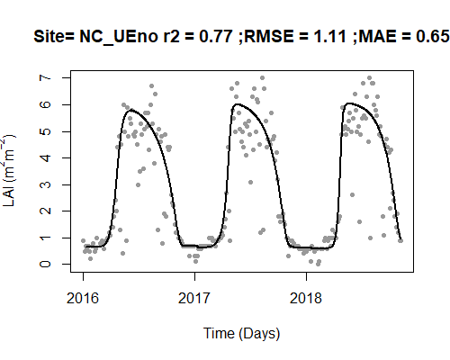

# Introduction

This article covers downloading and processing MODIS LAI data using the **StreamLightUtils** package. There are a variety of sources for LAI data, but for convenience a function is included in **StreamLightUtils** to process two MODIS LAI products: 1.) MCD15A3H.006 which has 4 day temporal resolution and a pixel size of 500m, and 2.) MCD15A2H.006 which has 8 day temporal resolution and a pixel size of 500m. This example uses MCD15A3H but once the data has been downloaded the process is the same for either product. These products are downloaded through the [AppEEARS website](https://lpdaacsvc.cr.usgs.gov/appeears/ "LP DAAC AppEEARS").

## 1. Submitting an AppEEARS request

The functions in **StreamLightUtils** are based on accessing LAI data through the [AppEEARS website](https://lpdaacsvc.cr.usgs.gov/appeears/ "LP DAAC AppEEARS"). This requires a NASA EARTH**DATA** account to access so if you do not already have an account you may [register here]("https://urs.earthdata.nasa.gov/users/new"). 

To submit a request, you will need a table of basic site information. 
A .csv of Site_ID, Lat and Lon can be used to submit a request that extracts point samples from multiple locations.

```{r, echo=TRUE, eval = FALSE}
#Make a table for the MODIS request 
  request_sites <- sites[, c("Site_ID", "Lat", "Lon")] 
          
#Export your sites as a .csv for the AppEEARS request  
  write.table(
    request_sites, 
    paste0(working_dir, "/NC_sites.csv"), 
    sep = ",", 
    row.names = FALSE,
    quote = FALSE, 
    col.names = FALSE
  )
```

Once you have registered and exported a table of site information, you can begin by making a request: 

- Click on Extract > Point Sample from the top menu bar
- On the next page select Start a new request
- The NC_sites.csv that was exported can now simply be drag-and-dropped to populate a list of sites. You may notice that special characters like "_" are removed from the ID field, don't worry this is ok. 
- Next, begin filling in the remaining information to submit a request including a name, Start Date, End Date, and the Selected layers. 
- If possible, **it is advisable to select dates with some time on either side of the desired period to estimate light**. This is to help constrain some of the LAI processing steps such as interpolating to daily values. For example, if I wanted to run the model for 2015 I might download LAI data from 2014-2016.
- Type MCD15A3H into the layers search box and select the product. Add all of the layers to the selected layers.    

Drag and drop site locations





Example of request submission


  

Once everything is filled out submit the request. You will recieve an email notification of the request and then a second notification when the download is ready. Downloads are typically ready the same day or within a day or two depending on the size of the request. For reference, the request in this example only took 15 minutes the complete.

## 2. Unpacking the downloaded LAI data

Once the download is ready it can be processed using two built-in functions to **StreamLightUtils**. The downloaded .zip file can be unpacked using **<span style="color:DarkOrange">AppEEARS_unpack_QC</span>** which has the following structure:

**<span style="color:DarkOrange">AppEEARS_unpack_QC</span>**(*<span style="color:#009faf">zip_file</span>*, *<span style="color:#009faf">zip_dir</span>*, *<span style="color:#009faf">request_sites</span>*)     

- *<span style="color:#009faf">zip_file</span>*  The name of the zip file. For example, "myzip.zip"
- *<span style="color:#009faf">zip_dir</span>*  The directory the zip file is located in. For example, "C:/"
- *<span style="color:#009faf">request_sites</span>*  A string of site IDs 

This function returns the unpacked data as a list, with each element in the list representing the data for a given site.

```{r, echo=TRUE, eval = FALSE}
MOD_unpack <- AppEEARS_unpack_QC(
  zip_file = "nc-sites.zip", 
  zip_dir = working_dir, 
  request_sites[, "Site_ID"]
)
```

## 3. Processing the downloaded LAI data

The **StreamLightUtils** package leverages the [**phenofit package**](https://github.com/kongdd/phenofit) to help handling the processing of LAI data. There are a variety of curve fitting methods and this tutorial uses the approach from [Gu et al. (2009)](https://doi.org/10.1007/978-1-4419-0026-5_2)  The unpacked data can then be processed using **<span style="color:DarkOrange">AppEEARS_proc</span>** which has the following structure: 

**<span style="color:DarkOrange">AppEEARS_proc</span>**(*<span style="color:#009faf">Site</span>*, *<span style="color:#009faf">proc_type</span>*)  

- *<span style="color:#009faf">unpacked_LAI</span>*  Output from the AppEEARS_unpack_QC function
- *<span style="color:#009faf">fit_method</span>*  There are several options available from the phenofit package including "AG", "Beck", "Elmore", "Gu", "Klos", "Zhang".
- *<span style="color:#009faf">write_ouput</span>*  Logical indicating whether to write each individual driver file to disk. Default value is FALSE.
- *<span style="color:#009faf">save_dir</span>*  Optional parameter when write_output = TRUE. The save directory for files to be placed in. For example, "C:/
- *<span style="color:#009faf">plot</span>*  Logical, where plot = TRUE generates a plot and plot = FALSE does not

Let's process the LAI data and visualize the results. The black line is the new fitted, interpolated, daily LAI.

```{r, out.width=c('50%', '50%'), fig.show='hold',echo=TRUE, eval = FALSE}
MOD_processed <- AppEEARS_proc(
  unpacked_LAI = MOD_unpack,  
  fit_method = "Gu", 
  plot = TRUE
)
```




