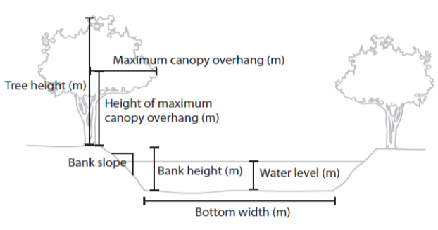

# Introduction

This article will demonstrate creating estimates of photosynthetically active radiation (PAR) using the **<span style="color:DarkOrange">stream_light</span>** function. The details and application of this model are detailed in [Savoy et al. (2021)](https://www.journals.uchicago.edu/doi/10.1086/714270).

**Outline**

1. <u>Overview:</u> General overview of the function structure.
2. <u>Preparing a driver file:</u> Assembling timeseries of model drivers to be fed into the model.
3. <u>Preparing a parameter file:</u> Creating a parameter file that describes various site conditions.
4. <u>Running **<span style="color:DarkOrange">stream_light</span>**:</u> Example code of how to run the model.

## 1. Introduction to the <span style="color:DarkOrange">stream_light</span> function

First, let's take a look at the **<span style="color:DarkOrange">stream_light</span>**  function which has the following structure:

**<span style="color:DarkOrange">stream_light</span>**(*<span style="color:#009faf">driver_file</span>*, *<span style="color:#009faf">Lat</span>*, *<span style="color:#009faf">Lon</span>*, *<span style="color:#009faf">channel_azimuth</span>*, *<span style="color:#009faf">bottom_width</span>*, *<span style="color:#009faf">BH</span>*, *<span style="color:#009faf">BS</span>*, *<span style="color:#009faf">WL</span>*, *<span style="color:#009faf">TH</span>*, *<span style="color:#009faf">overhang_height</span>*, *<span style="color:#009faf">x_LAD</span>*) 

- *<span style="color:#009faf">driver_file</span>* The model driver file
- *<span style="color:#009faf">Lat</span>* The site latitude
- *<span style="color:#009faf">Lon</span>* The site longitude
- *<span style="color:#009faf">channel_azimuth</span>* Channel azimuth
- *<span style="color:#009faf">bottom_width</span>* Bottom width (m)
- *<span style="color:#009faf">BH</span>* Bank height (m)
- *<span style="color:#009faf">BS</span>* Bank slope
- *<span style="color:#009faf">WL</span>* Water level (m)
- *<span style="color:#009faf">TH</span>* Tree height (m)
- *<span style="color:#009faf">overhang</span>* Maximum canopy overhang (m)
- *<span style="color:#009faf">overhang_height</span>* Height of the maximum canopy overhang (m). If overhang_height = NA, then the model defaults to a value of 75% of tree height.
- *<span style="color:#009faf">x_LAD</span>* Leaf angle distribution, default = 1

Running **<span style="color:DarkOrange">stream_light</span>** model requires a parameter file that describes various site characteristics and a driver file that contains inputs into the model. The first argument for the function (*<span style="color:#009faf">driver_file</span>*) is a standardized model driver file that contains total incoming irradiance (W m<sup>-2</sup>) and leaf area index (LAI) (m^2^ m^-2^) which are used as model inputs. The remaining arguments in the function are parameters that describe site characteristics. On the surface this seems like a large number of parameters;however, this tutorial provides more indepth information on each of these parameters and some simplifying assumptions that can be used to reduce the number of necessary parameters. 

## 2. Preparing a driver file

There are two necessary components to drive **<span style="color:DarkOrange">stream_light</span>**. First, incoming above canopy total irradiance (W m^-2^) is needed as an input into the radiative transfer model. Second, daily estimates of LAI are needed to determine the attenuation of light by canopies within the radiative transfer model. A set of functions is included in the **StreamLightUtils** package to help create a standardized model driver file. 

The structure of the model driver is as follows:

- **<span style="color:#009688">"local_time"</span>**: A POSIXct object in local time
- **<span style="color:#009688">"offset"</span>**: The UTC offset for local time (hours), used in the **<span style="color:DarkOrange">solar_c function</span>**
- **<span style="color:#009688">"jday"</span>**: A unique identifier for each day that combines year and day of year information in the format YYYYddd
- **<span style="color:#009688">"DOY"</span>**: The day of year (1-365 or 366 for leap years)
- **<span style="color:#009688">"Hour"</span>**: Hour of the day (0-23)
- **<span style="color:#009688">"SW_inc"</span>**: Total incoming downwelling shortwave radiation (W m^-2^). **StreamLightUtils** provides tools to get hourly data from NLDAS.
- **<span style="color:#009688">"LAI"</span>**: MODIS leaf area index (m^2^ m^-2^). **StreamLightUtils** provides tools to generate interpolated to daily values using the **<span style="color:DarkOrange">AppEEARS_proc</span>** function.

A driver file with the same structure as above can be made using the **<span style="color:DarkOrange">make_driver</span>** function from **StreamLightUtils** which has the following structure:

**<span style="color:DarkOrange">make_driver</span>**(*<span style="color:#009faf">site_locs</span>*, *<span style="color:#009faf">NLDAS_processed</span>*, *<span style="color:#009faf">MOD_processed</span>*, *<span style="color:#009faf">write_output</span>*, *<span style="color:#009faf">save_dir</span>*) 

- *<span style="color:#009faf">site_locs</span>* A table with Site_ID, Lat, and Lon, and the coordinate reference system designated as an EPSG code. 
  For example, the most common geographic system is WGS84 and its EPSG code is 4326
- *<span style="color:#009faf">NLDAS_processed</span>* Output from the **<span style="color:DarkOrange">NLDAS_proc</span>** function (from **StreamLightUtils**)
- *<span style="color:#009faf">MOD_processed</span>* Output from the **<span style="color:DarkOrange">AppEEARS_proc</span>** function (from **StreamLightUtils**)
- *<span style="color:#009faf">write_output</span>* Logical value to indicate whether to write each individual driver file to disk. Default value is FALSE.
- *<span style="color:#009faf">save_dir</span>* Optional parameter when write_output = TRUE. The save directory for files to be placed in. For example, "C:/

```{r, echo=FALSE, eval=FALSE}
#Make the driver files
make_driver(
  site_locs = sites,
  NLDAS_processed = NLDAS_processed,
  MOD_processed = MOD_processed
)
```

Let's take a moment to examine the final structure of the driver file

```{r, echo=TRUE, eval = FALSE}
#Read in a driver file
  data(NC_NHC_driver)
  head(NC_NHC_driver)
```

 

## 3. Preparing a parameter file

There are several site parameters required to run **<span style="color:DarkOrange">stream_light</span>**; however, not all of these parameters have built in functions within **StreamLightUtils**. Similarly, not all parameters are easily obtained nor will they all have equal importance for model performance. Here, we detail the same process used to extract parameter values from [Savoy et al. (2021)](https://www.journals.uchicago.edu/doi/10.1086/714270). To begin with, let's revisit the parameters used:
   

   

- *<span style="color:#009faf">Lat</span>* The site latitude
- *<span style="color:#009faf">Lon</span>* The site longitude
- *<span style="color:#009faf">channel_azimuth</span>* Channel azimuth
- *<span style="color:#009faf">bottom_width</span>* Bottom width (m) 
- *<span style="color:#009faf">BH</span>* Bank height (m)
- *<span style="color:#009faf">BS</span>* Bank slope
- *<span style="color:#009faf">WL</span>* Water level (m)
- *<span style="color:#009faf">TH</span>* Tree height (m)
- *<span style="color:#009faf">overhang</span>* Maximum canopy overhang (m)
- *<span style="color:#009faf">overhang_height</span>* Height of the maximum canopy overhang (m)
- *<span style="color:#009faf">x_LAD</span>*  Leaf angle distribution

To run the model on multiple sites it is easiest to construct a table of parameters for each site such as the following example. 

```{r, echo=FALSE, eval = FALSE}
#Load the example parameter file
  data(NC_params)
  head(NC_params, n = 2)
```

### **Parameter descriptions and values**  

#### **Channel azimuth (*<span style="color:#009faf">channel_azimuth</span>*)**

Currently there is no functionality to derive stream azimuth within **StreamLightUtils**. In the meantime, these can be derived manually using aerial photographs, flowlines, or field derived measurements. Because we have based our model on SHADE2 (Li et al., 2012), we follow their conventions where stream azimuth is measured clockwise from North (see figure below). However, at present both banks are parameterized identically in **StreamLight** (e.g. only a single tree height is put in instead of the heights of trees on either bank) and so in reality a channel azimuth of 45$^\circ$ and 225$^\circ$ will yield the same results. We only mention this point in case future development may allow for parameterizing banks separately, or in case someone wanted to modify the code on their own to add in this functionality.

Example of deriving azimuth, note the first azimuth of the first example is 45$^\circ$ whereas the second example is 315$^\circ$.      

  

#### **Width (*<span style="color:#009faf">bottom_width</span>*)**

The widths used in this tutorial are from field measurements. However, if field measurements are not available or feasible there are various remotely sensed products such as the [NARWidth dataset](http://gaia.geosci.unc.edu/NARWidth/) from [Allen & Pavelsky](https://science.sciencemag.org/content/361/6402/585). There are also empirically-derived estimates, such as those from [McManamay & DeRolph, 2019](https://www.nature.com/articles/sdata201917).

#### **Bank height (*<span style="color:#009faf">BH</span>*)**

Without detailed information of bank heights a default value of 0.1m was used for all sites.

#### **Bank slope (*<span style="color:#009faf">BS</span>*)**

Without detailed information of bank slopes a default value of 100 was used for all sites.

#### **Water level (*<span style="color:#009faf">WL</span>*)**

Without detailed information of water level a default value of 0.1m was used for all sites.

#### **Tree height (*<span style="color:#009faf">TH</span>*)**

**StreamLightUtils** has a built in function to derive tree height using the LiDAR derived estimates of Simard et al. (2011). The function **<span style="color:DarkOrange">extract_height</span>** will retrieve an estimate of tree height (m) based on latitude and longitude and has the following structure:

**<span style="color:DarkOrange">extract_height</span>**(*<span style="color:#009faf">Site_ID</span>*, *<span style="color:#009faf">Lat</span>*, *<span style="color:#009faf">Lon</span>*)     

- *<span style="color:#009faf">Site_ID</span>* The site identifier ("Site_ID")
- *<span style="color:#009faf">Lat</span>* The site latitude
- *<span style="color:#009faf">Lon</span>* The site longitude
- *<span style="color:#009faf">site_crs</span>* The coordinate reference system of the points, preferably designated as an EPSG code. For example, the most common geographic system is WGS84 and its EPSG code is 4326.
      

Although this parameter file already contains tree height, the following is an example of how to use this funciton

```{r, echo=TRUE, eval = FALSE}
#Extract tree height
  extract_height(
    Site_ID = NC_params[, "Site_ID"], 
    Lat = NC_params[, "Lat"],
    Lon = NC_params[, "Lon"],
    site_crs = NC_params[, "epsg_crs"]
  )
```

#### **Maximum canopy overhang (*<span style="color:#009faf">overhang</span>*)**

Without detailed information on canopy overhang it was assumed that overhang was 10% of tree height at all sites.

#### **Height of maximum canopy overhang (*<span style="color:#009faf">overhang_height</span>*)**

Without detailed information on the height of maximum canopy overhang a value of NA can be used. When *<span style="color:#009faf">overhang_height</span>* = NA, the model will default to using 75% of tree height.

#### **Leaf angle distribution(*<span style="color:#009faf">x_LAD</span>*)**

Most canopies can be approximated by a spherical distribution of leaf angles (*x* = 1) (Campbell & Norman, 1998), and so *<span style="color:#009faf">x_LAD</span>* was set to 1 at all sites.

## 4. Running StreamLight

First time installation of the **StreamLight** package from GitHub can be done with the devtools library and once installed, the package can be loaded as normal.

```{r, echo=TRUE, eval = FALSE}
devtools::install_github("psavoy/StreamLight")
library("StreamLight")
```

Estimates of average light across a transect can be estimated using the **<span style="color:DarkOrange">stream_light</span>**  function which has the following structure:

**<span style="color:DarkOrange">stream_light</span>**(*<span style="color:#009faf">driver_file</span>*, *<span style="color:#009faf">Lat</span>*, *<span style="color:#009faf">Lon</span>*, *<span style="color:#009faf">channel_azimuth</span>*, *<span style="color:#009faf">bottom_width</span>*, *<span style="color:#009faf">BH</span>*, *<span style="color:#009faf">BS</span>*, *<span style="color:#009faf">WL</span>*, *<span style="color:#009faf">TH</span>*, *<span style="color:#009faf">overhang_height</span>*, *<span style="color:#009faf">x_LAD</span>*) 

  * *<span style="color:#009faf">driver_file</span>* The model driver file
  * *<span style="color:#009faf">Lat</span>* The site latitude
  * *<span style="color:#009faf">Lon</span>* The site longitude
  * *<span style="color:#009faf">channel_azimuth</span>* Channel azimuth
  * *<span style="color:#009faf">bottom_width</span>* Bottom width (m)
  * *<span style="color:#009faf">BH</span>* Bank height (m)
  * *<span style="color:#009faf">BS</span>* Bank slope
  * *<span style="color:#009faf">WL</span>* Water level (m)
  * *<span style="color:#009faf">TH</span>* Tree height (m)
  * *<span style="color:#009faf">overhang</span>* Maximum canopy overhang (m)
  * *<span style="color:#009faf">overhang_height</span>* Height of the maximum canopy overhang (m). If overhang_height = NA, then the model defaults to a value of 75% of tree height.
  * *<span style="color:#009faf">x_LAD</span>* Leaf angle distribution, default = 1

As outlined in the previous section on preparing parameter files. In [Savoy et al. (2021)](https://www.journals.uchicago.edu/doi/10.1086/714270) we made some simplifying assumptions to facilitate applying this model easily to locations that lacked detailed *in situ* measurements.

### **Generate estimates for a single site**

To run the model for a single site simply add the parameters to the function.

```{r, echo = TRUE, eval = FALSE}
#Load the example driver file for NC_NHC
  data(NC_NHC_driver)

#Run the model
  NC_NHC_modeled <- stream_light(
    NC_NHC_driver, 
    Lat = 35.9925, 
    Lon = -79.0460, 
    channel_azimuth = 330, 
    bottom_width = 18.9, 
    BH = 0.1, 
    BS = 100, 
    WL = 0.1, 
    TH = 23, 
    overhang = 2.3, 
    overhang_height = NA, 
    x_LAD = 1
  )
```

### **Generate estimates for multiple sites**

It is also possible to then loop over multiple sites by wrapping the model in another function and below is an example of this that could be adapted to your own workflow.

```{r, echo=TRUE, results = 'hide', eval = FALSE}
#Function for batching over multiple sites
  batch_model <- function(Site, read_dir, save_dir){
    #Get the model driver
      driver_file <- readRDS(paste(read_dir, "/", Site, "_driver.rds", sep = ""))

    #Get model parameters for the site
      site_p <- params[params[, "Site_ID"] == Site, ]

    #Run the model
      modeled <- stream_light(
        driver_file, 
        Lat = site_p[, "Lat"], 
        Lon = site_p[, "Lon"],
        channel_azimuth = site_p[, "Azimuth"], 
        bottom_width = site_p[, "Width"], 
        BH = site_p[, "BH"],
        BS = site_p[, "BS"], 
        WL = site_p[, "WL"], 
        TH = site_p[, "TH"], 
        overhang = site_p[, "overhang"],
        overhang_height = site_p[, "overhang_height"], 
        x_LAD = site_p[, "x"]
      )

    #Save the output
      saveRDS(modeled, paste(save_dir, "/", Site, "_predicted.rds", sep = ""))

  } #End batch_model 

#Applying the model to all sites
  model_rd <- working_dir
  model_sd <- working_dir

#Running the model
  lapply(
    params[, "Site_ID"], 
    FUN = batch_model, 
    read_dir = model_rd,
    save_dir = model_sd
  ) 

#Take a look at the output
  data(NC_NHC_predicted)
  NC_NHC_predicted[1:2, ]
```

The columns are as follows: 

- **<span style="color:#009688">"local_time"</span>**: A POSIXct object in local time
- **<span style="color:#009688">"offset"</span>**: The UTC offset for local time (hours), used in the **<span style="color:DarkOrange">solar_c function</span>**
- **<span style="color:#009688">"jday"</span>**: A unique identifier for each day that combines year and day of year information in the format YYYYddd
- **<span style="color:#009688">"DOY"</span>**: The day of year (1-365 or 366 for leap years)
- **<span style="color:#009688">"Hour"</span>**: Hour of the day (0-23)
- **<span style="color:#009688">"SW_inc"</span>**: Total incoming downwelling shortwave radiation (W m^-2^). **StreamLightUtils** provides tools to get hourly data from NLDAS.
- **<span style="color:#009688">"LAI"</span>**: MODIS leaf area index (m^2^ m^-2^). **StreamLightUtils** provides tools to generate interpolated to daily values using the **<span style="color:DarkOrange">AppEEARS_proc</span>** function. 
- **<span style="color:#009688">"PAR_inc"</span>**: Incoming PAR above the canopy (<font size="+1">$\mu$</font>mol m^-2^ s^-1^) 
- **<span style="color:#009688">"PAR_bc"</span>**: Estimated PAR (<font size="+1">$\mu$</font>mol m^-2^ s^-1^) directly below the canopy 
- **<span style="color:#009688">"veg_shade"</span>**: The proportion of the channel crossection that is shaded by riparian vegetation
- **<span style="color:#009688">"bank_shade"</span>**: The proportion of the channel crossection that is shaded by stream banks
- **<span style="color:#009688">"PAR_stream"</span>**: The estimated PAR for the channel cross section (<font size="+1">$\mu$</font>mol m^-2^ s^-1^)

