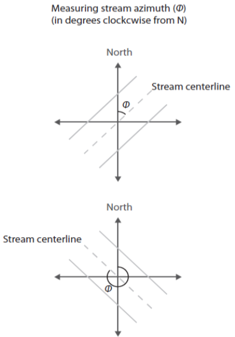

# Introduction

This article will demonstrate creating estimates of photosynthetically active radiation (PAR) using the **<span style="color:DarkOrange">aqua_light</span>** function. The details and application of this model are detailed in [Savoy & Harvey. (2021a)](https://agupubs.onlinelibrary.wiley.com/doi/abs/10.1029/2020GL092149), and the modeled estimates from this paper are available in a [ScienceBase data release (Savoy & Harvey, 2021b)](https://www.sciencebase.gov/catalog/item/5f974adfd34e198cb77db168).

There are many ways to derive values for site parameters or model drivers; however, this document focuses on the approaches used in [Savoy & Harvey. (2021a)](https://agupubs.onlinelibrary.wiley.com/doi/abs/10.1029/2020GL092149) and does not give an exhaustive set of possibilities.

**Outline**

1. <u>Overview:</u> General overview of the function structure.
2. <u>Preparing a driver file:</u> Assembling timeseries of model drivers to be fed into the model.
3. <u>Preparing a parameter file:</u> Creating a parameter file that describes various site conditions.
4. <u>Running **<span style="color:DarkOrange">aqua_light</span>**:</u> Example code of how to run the model to generate estimates in this data release and brief explanation of model outputs.
6. <u>Appendix:</u> Governing equations for light reflection and attenuation as a function of depth and clarity.

## 1. Introduction to the **<span style="color:DarkOrange">aqua_light</span>** function

This tutorial will cover the basic model inputs, model structure, and model outputs. First, let's take a look at the **<span style="color:DarkOrange">aqua_light</span>** function which has the following structure:

**<span style="color:DarkOrange">aqua_light</span>**(*<span style="color:#009faf">driver_file</span>*, *<span style="color:#009faf">Lat</span>*, *<span style="color:#009faf">Lon</span>*, *<span style="color:#009faf">channel_azimuth</span>*, *<span style="color:#009faf">bankfull_width</span>*, *<span style="color:#009faf">BH</span>*, *<span style="color:#009faf">TH</span>*, *<span style="color:#009faf">overhang</span>*, *<span style="color:#009faf">overhang_height</span>*, *<span style="color:#009faf">x_LAD</span>*)

- *<span style="color:#009faf">driver_file</span>*  The model driver file
- *<span style="color:#009faf">Lat</span>*  The site latitude
- *<span style="color:#009faf">Lon</span>*  The site longitude
- *<span style="color:#009faf">channel_azimuth</span>*  Channel azimuth
- *<span style="color:#009faf">bankfull width</span>*  Bankfull width (m)
- *<span style="color:#009faf">BH</span>*  Bankfull height (m)
- *<span style="color:#009faf">TH</span>*  Tree height (m)
- *<span style="color:#009faf">overhang</span>*  Maximum canopy overheight (m)
- *<span style="color:#009faf">overhang_height</span>*  Height of the maximum canopy overhang (m). If overhang_height = NA, then the model defaults to a value of 75% of tree height.
- *<span style="color:#009faf">x_LAD</span>*  Leaf angle distribution, default = 1

Running **<span style="color:DarkOrange">aqua_light</span>** model requires a parameter file that describes various site characteristics and a driver file that contains inputs into the model. The first argument for the function (*<span style="color:#009faf">driver_file</span>*) is a standardized model driver file that contains timeseries of model inputs. The remaining arguments in the function are parameters that describe site characteristics. Section 2 gives more information about creating a model driver file and section 3 details the creation of a site parameter file.

## 2. Preparing a driver file

The structure of the model driver is as follows:

- **<span style="color:#009688">"local_time"</span>**: Local time in the format YYYY-mm-dd HH:MM:SS based on the site timezone
- **<span style="color:#009688">"offset"</span>**: The UTC offset for local time (hours)
- **<span style="color:#009688">"jday"</span>**: A unique identifier for each day that combines year and day of year information in the format YYYYddd
- **<span style="color:#009688">"Year"</span>** The year
- **<span style="color:#009688">"DOY"</span>**: The day of year (1-365 or 366 for leap years)
- **<span style="color:#009688">"Hour"</span>**:  Hour of the day (0-23)
- **<span style="color:#009688">"SW_inc"</span>**: Total incoming downwelling shortwave radiation (W m^-2^). **StreamLightUtils** provides tools to get hourly data from NLDAS.
- **<span style="color:#009688">"LAI"</span>**: MODIS leaf area index (m^2^ m^-2^). **StreamLightUtils** provides tools to generate interpolated to daily values using the **<span style="color:DarkOrange">AppEEARS_proc</span>** function. 
- **<span style="color:#009688">"depth"</span>**: Water depth (m)
- **<span style="color:#009688">"width"</span>**: Wetted width (m)
- **<span style="color:#009688">"kd_pred"</span>**: The irradiance attenuation coefficient (m ^-1^)

Preparing a driver file may depend on available data at a site or the needs of individual researchers. The [**StreamLightUtils**](https://github.com/psavoy/StreamLightUtils) package provides utilities to generate a standardized driver file that contains **<span style="color:#009688">"local_time"</span>**, **<span style="color:#009688">"offset"</span>**, **<span style="color:#009688">"jday"</span>**, **<span style="color:#009688">"Year"</span>**, **<span style="color:#009688">"DOY"</span>**, **<span style="color:#009688">"Hour"</span>**, **<span style="color:#009688">"SW_inc"</span>**, and **LAI**. The following sections provide information about the approaches used in [Savoy & Harvey. (2021a)](https://agupubs.onlinelibrary.wiley.com/doi/abs/10.1029/2020GL092149) to derive **<span style="color:#009688">"depth"</span>**, **<span style="color:#009688">"width"</span>**, and **<span style="color:#009688">"kd_pred"</span>**.

### Depth (**<span style="color:#009688">"depth"</span>**)

Depth could be measured or estimated in a variety of ways, and one possibility is to estimate depth as a function of discharge and hydraulic geometry coefficients following [Gomez-Velez et al. (2015)](https://doi.org/10.1038/ngeo2567) (depth = *c* * Q*^f^*), where Q is discharge (m^3^ s^-1^) and the terms *c* and *f* are empirical coefficients. The hydraulic geometry coefficients of [Gomez-Velez et al. (2015)](https://doi.org/10.1038/ngeo2567) are included in the [Appling et al. (2018)](https://www.sciencebase.gov/catalog/item/59bff507e4b091459a5e0982) for 356 U.S. rivers; however, since [Appling et al. (2018)](https://www.sciencebase.gov/catalog/item/59bff507e4b091459a5e0982) have already done this conversion we have used their values. These depths represent mean depth averaged over the reach length and width for the date (4am to 3:59pm).

### Width (**<span style="color:#009688">"width"</span>**)

Similar to depth, we estimated width as a function of discharge and the hydraulic geometry coefficients following [Gomez-Velez et al. (2015)](https://doi.org/10.1038/ngeo2567) (width = *a* * Q*^b^*), where Q is discharge (m^3^ s^-1^) and the terms *a* and *b* are empirical coefficients. We used mean daily discharge to calculate mean width for the date (4am to 3:59pm).

### Irradiance attenuation coefficient (**<span style="color:#009688">"kd_pred"</span>**)

To get a timeseries of irradiance attenuation coefficients (*K~d~*) we developed an empirical log-log linear relationship between turbidity (FNU) and *K~d~*:
$$
log(K_d) = 0.52 * log(turbidity) - 0.26
$$

## 3. Preparing a parameter file

### Channel azimuth (*<span style="color:#009faf">channel_azimuth</span>*)

Currently there is no functionality to derive stream azimuth within the **StreamLightUtils** package. In the meantime, these can be derived manually using aerial photographs, flowlines, or field derived measurements. The functions used to calculate shading [(Li et al., 2012)](https://www.sciencedirect.com/science/article/abs/pii/S0022169412000753) follow the convention where stream azimuth is measured clockwise from North. However, since both banks are parameterized identically in both **<span style="color:DarkOrange">stream_light</span>** and ***<span style="color:DarkOrange">aqua_light</span>**, this distinction is less relevant and an azimuth of 45$^{\circ}$ and 225$^\circ$ will yield the same results. We only mention this point in case future development may allow for parameterizing banks separately, or in case someone wanted to modify the code on their own to add in this functionality.

Example of deriving azimuth, note the first azimuth of the first example is 45$^\circ$ whereas the second example is 315$^\circ$.      

  

### Bankfull width (*<span style="color:#009faf">bankfull_width</span>*)

We estimated bankfull channel width from regionalized hydraulic geometry coefficients as a function of discharge [(Gomez-Velez et al. 2015)](https://doi.org/10.1038/ngeo2567). Bankfull widths could also be acquired field measurements or several remotely-sensed or empirically-derived products.

### Bank height (*<span style="color:#009faf">BH</span>*)

We estimated bank heights based on the maximum predicted water depth at each site, but field surveys or LiDAR data could be alternative sources to derive this parameter.

### Tree height (*<span style="color:#009faf">TH</span>*)

Tree heights were derived from global estimates of canopy heights at 30m resolution from [Potapov et al. (2021)](https://www.sciencedirect.com/science/article/abs/pii/S0034425720305381?dgcid=rss_sd_all). The 90th percentile of tree height within a 60m buffer into the riparian zone was calculated for each site.

Alternatively, users can use the **<span style="color:DarkOrange">extract_height</span>** function from the **StreamLightUtils** package to extract 1km LiDAR data from Simard et al. (2011) based on latitude and longitude.

### Maximum canopy overhang (*<span style="color:#009faf">overhang</span>*)

Without detailed information on canopy overhang it was assumed that overhang was 10% of tree height at all sites. In [Savoy et al. (2021)](https://www.journals.uchicago.edu/doi/10.1086/714270) a 10% overhang was used to validate the **<span style="color:DarkOrange">stream_light</span>** function; however, this is a rather simple assumption. [Savoy et al. (2021)](https://www.journals.uchicago.edu/doi/10.1086/714270) gives some suggestions of potential data sources that could be used to refine these estimates.

### Height of maximum canopy overhang (*<span style="color:#009faf">overhang_height</span>*)

Without detailed information on the height of maximum canopy overhang a value of NA can be used. When *<span style="color:#009faf">overhang_height</span>* = NA, the model will default to using 75% of tree height.

### Leaf angle distribution (*<span style="color:#009faf">x_LAD</span>*)

Most canopies can be approximated by a spherical distribution of leaf angles (*x* = 1) (Campbell & Norman, 1998), and so *<span style="color:#009faf">x_LAD</span>* was set to 1 at all sites.


## 4 Running **<span style="color:DarkOrange">aqua_light</span>**

As part of a ScienceBase data release [(Savoy & Harvey, 2021b)](https://www.sciencebase.gov/catalog/item/5f974adfd34e198cb77db168), a prepared R environment (loaded_environment.RData) contains necessary inputs and outputs from **<span style="color:DarkOrange">aqua_light</span>**. This data is used below to demonstrate the use of **<span style="color:DarkOrange">aqua_light</span>**. Before beginning it is necessary to download and load in the prepared R environment (loaded_environment.RData) using the load command. For example if this file was located in the C:/ directory:

```{r setup, eval=FALSE}
load("C:/loaded_environment.RData")
```

To easily run the model across many sites a wrapper function is included below. This will get the relevant parameters and driver files for each site and return the modeled estimates

```{r, eval = FALSE}
batch_model <- function(Site_ID, model_parameters, model_drivers){
  #Print a message to keep track of progress
    message(paste0("Generating modeled estimates for ", Site_ID))
      
  #Get the model driver
    driver_file <- model_drivers[[Site_ID]]
      
  #The input_output file contains the model inputs and outputs, let's select just the necessary
  #input columns to reduce confusion
    model_driver <- driver_file[, c("local_time", "offset", "jday", "Year", "DOY", "Hour", "SW_inc",
      "LAI", "kd_pred", "depth", "width")]
   
  #Get model parameters for the site
    site_p <- model_parameters[model_parameters[, "Site_ID"] == Site_ID, ]
    
  #Run the model
    modeled <- aqua_light(
      driver_file = model_driver, 
      Lat = site_p[, "Lat"], 
      Lon = site_p[, "Lon"],
      channel_azimuth = site_p[, "Azimuth"], 
      bankfull_width = site_p[, "width_harvey"], 
      BH = site_p[, "bank_height"],
      TH = site_p[, "TH"], 
      overhang = site_p[, "overhang"],
      overhang_height = site_p[, "overhang_height"],
      x_LAD = site_p[, "x"]
    )
    
  return(modeled)
      
} #End batch_model
```

The next step is to simply apply this function across all sites. Here, the model drivers have been placed into a single list to easily loop over each site driver file.

```{r, eval = FALSE}
modeled_estimates <- lapply(
  names(inputs_outputs),
  FUN = batch_model,
  model_parameters = site_parameters,
  model_drivers = inputs_outputs
)
```

The modeled output contains the following columns:

- **<span style="color:#009688">"local_time"</span>**: Local time in the format YYYY-mm-dd HH:MM:SS based on the site timezone
- **<span style="color:#009688">"offset"</span>**: The UTC offset for local time (hours)
- **<span style="color:#009688">"jday"</span>**: A unique identifier for each day that combines year and day of year information in the format YYYYddd
- **<span style="color:#009688">"Year"</span>** The year
- **<span style="color:#009688">"DOY"</span>**: The day of year (1-365 or 366 for leap years)
- **<span style="color:#009688">"Hour"</span>**:  Hour of the day (0-23)
- **<span style="color:#009688">"SW_inc"</span>**: Total incoming downwelling shortwave radiation (W m^-2^). **StreamLightUtils** provides tools to get hourly data from NLDAS. Specifically, the data used in this example is from the North American Land Data Assimilation System (NLDAS) (original attribute name  DSWRFsfc) . This data was downloaded and processed using the **StreamLightUtils** package.
- **<span style="color:#009688">"LAI"</span>**: MODIS leaf area index (m^2^ m^-2^). **StreamLightUtils** provides tools to generate interpolated to daily values using the **<span style="color:DarkOrange">AppEEARS_proc</span>** function. Specifically, the data used in this example is MODIS 8-day 500m leaf area index (MCD15A2H-006). This data has been interpolated to daily values following the method of [Gu et al. (2009)](https://doi.org/10.1007/978-1-4419-0026-5_2) using the **StreamLightUtils** package, which leverages these routines from the [**phenofit**](https://cran.r-project.org/web/packages/phenofit/index.html) R package. 
- **<span style="color:#009688">"depth"</span>**: Water depth (m). Specifically, the data used in this example is mean depth (m), averaged over the reach length and width, for the date (4am to 3:59pm) from [Appling et al. (2018)](https://www.sciencebase.gov/catalog/item/59bff507e4b091459a5e0982).
- **<span style="color:#009688">"width"</span>**: Wetted width (m). Specifically, the data used in this example is mean width (m) for the date (4am to 3:59pm) calculated from the mean discharge and the equation to estimate width as a function of discharge (width = a * Qb) of Gomez-Velez et al. (2015).
- **<span style="color:#009688">"kd_pred"</span>**: The predicted irradiance attenuation coefficient (*K~d~*, m*^-1^*) for turbid water. Here, we predicted this based on the current turbidity using a log-log linear regression between *K~d~* and turbidity that was derived from *in situ* measurements.
- **<span style="color:#009688">"PAR_inc"</span>**: Incoming, above the canopy, PAR ($\mu$mol m*^-2^ s^-1^*)
- **<span style="color:#009688">"veg_shade"</span>**: The proportion of the channel crossection that is shaded by riparian vegetation
- **<span style="color:#009688">"bank_shade"</span>**: The proportion of the channel crossection that is shaded by stream banks
- **<span style="color:#009688">"PAR_surface"</span>**: Estimated PAR at the stream surface ($\mu$mol m^-2^ s^-1^)
- **<span style="color:#009688">"PAR_subsurface"</span>**: Estimated PAR below the stream surface ($\mu$mol m^-2^ s^-1^)
- **<span style="color:#009688">"PAR_water"</span>**: Estimated PAR at the benthic surface assuming optically clear water ($\mu$mol m^-2^ s^-1^)
- **<span style="color:#009688">"kd_water"</span>**: Irradiance attenuation coefficient for optically clear water 
- **<span style="color:#009688">"PAR_turb"</span>**: Estimated PAR at the benthic surface for turbid water ($\mu$mol m^-2^ s^-1^)
- **<span style="color:#009688">"kd_turb"</span>**: The irradiance attenuation coefficient for turbid water. This value is predicted based on the current turbidity using a log-log linear regression between Kd and turbidity that was derived from *in situ* measurements.

  *Note, modeled predictions of PAR will have NA values when the sun is below the horizon.
  
## 5. Appendix

The **<span style="color:DarkOrange">aqua_light</span>** adds several proceses to the existing **<span style="color:DarkOrange">stream_light</span>** function including water surface reflection and attenuation as a function of depth and clarity. Therefore, only these new processes are documented below.

### 5.1 Water surface reflection

The proportion of incident light reflected by the surface of the water ($R_l$) was calculated following Kirk et al. (2011):


$$
\begin{align*}R_l = \frac{1}{2} *  \frac{sin^2(\theta_a - \theta_w)}{sin^2(\theta_a + \theta_w)} + \frac{1}{2} *\frac{tan^2(\theta_a - \theta_w)}{tan^2(\theta_a + \theta_w)}\\\end{align*}
$$


where $\theta_a$ is the solar zenith angle and $\theta_w$ is the angle of refraction within the water. $\theta_w$ was calculated following Snell's law:
$$
\frac{sin \theta_a}{sin \theta_w}= \frac{n_w}{n_a}
$$
where $n_w$ is the refractive index for water and $n_a$ is the refractive index of water. Air and water have different refractive properties but a value of 1.33 for the ratio of the refractive indices of air to water is a good approximation for
freshwater and the wavelengths of light within photosynthetically active radiation (PAR) (Kirk et al, 2011):
$$
\frac{n_w}{n_a} = 1.33
$$

### 5.2 Water column light extinction

Within the water column light attenuates nonlinearly with depth which can be described using a Beer-Lambert equation:
$$
I_z = I_{sub}e^{-{K_d}*z}
$$
where light at a given depth ($I_z$) can be calculated using light just below the water surface ($I_{sub}$), depth ($z$), and the extinction coefficient ($K_d$).

### Appendix References

Kirk, J. T. O. (2011). Light and photosynthesis in aquatic ecosystems (3rd ed.). Cambridge, UK 455 and New York: Cambridge University Press.  
